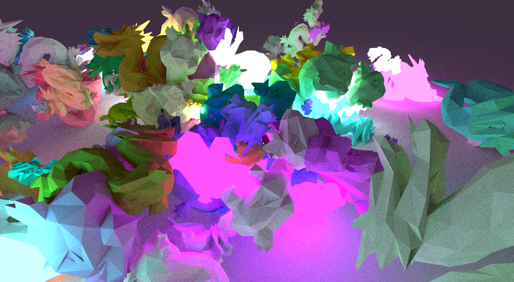
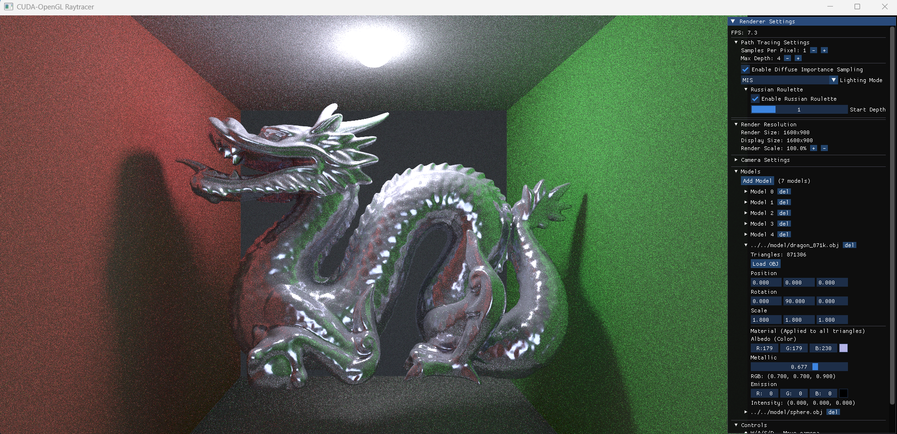

# CUDA + OpenGL + BVH Path Tracing Renderer

An interactive path tracing sample on Windows using CUDA–OpenGL interop (PBO). It supports:
- CUDA device path tracing (multi-bounce, GGX specular, cosine / uniform hemisphere sampling, Russian Roulette)
- Unified scene triangle consolidation and single BVH acceleration structure
- Direct / Indirect / MIS (Multiple Importance Sampling) lighting modes
- Runtime ImGui controls (samples per pixel, max depth, lighting mode, importance sampling, Russian Roulette)
- Procedural scattering of many OBJ models (example: 100 randomized dragons with random color + emission probability)
- GPU accumulation buffer (progressive refinement / noise reduction)

  
  

## Core Pipeline
1. Application init: Window → OpenGL → ImGui → GPU PBO → Scene (scatter models)
2. Scene collects triangles from all `Model` objects, builds a single BVH, gathers materials & light triangle indices.
3. Render loop:
   - Detect camera/scene dirty → reset accumulation → rebuild + upload
   - CUDA kernel performs per-pixel multi-sample path tracing (Spp)
   - Kernel writes to registered PBO; OpenGL updates screen texture
   - ImGui overlays control panel

## Path Tracing Highlights
- BRDF:
  - Diffuse: Lambert (albedo / π)
  - Metallic: GGX microfacet + Smith geometry term + Fresnel Schlick
- Importance Sampling: optional cosine-weighted hemisphere for diffuse
- MIS: combines light sampling and BSDF sampling using power heuristic
- Light handling: all emissive model triangles become light sampling set (area sampling)
- Russian Roulette: after threshold depth, terminate based on max throughput component, energy-conserving
- Accumulation: `accumulated_radiance[pixel] = mix(previous, current, 1/(frame+1))`

## Models & Emission
- RapidOBJ parses arbitrary polygon faces → triangulated by fan method
- Each `Model` can receive randomized `Material` + `emission` on CPU; emission stored in `MaterialGpu` during upload
- Emissive test: `glm::dot(emission, emission) > 0` marks triangle as light

## ImGui Adjustable Parameters
- Samples Per Pixel (Spp)
- Max Path Depth
- Lighting Mode: Direct / Indirect / MIS
- Diffuse Importance Sampling toggle
- Russian Roulette toggle + start depth
- Camera: FOV / position / yaw / pitch / movement
- Per-model editing: position, rotation, scale, Albedo, Metallic, Emission, dynamic OBJ loading

## Build Requirements (Windows)
- Visual Studio 2022 (MSVC x64 toolchain)
- CUDA Toolkit 12.x (compatible with VS)
- CMake >= 3.18

## Build Steps (PowerShell)
```powershell
mkdir build
cd build
cmake .. -G "Visual Studio 17 2022" -A x64
cmake --build . --config Release
```

Run after build (inside `build/Release/`):
```powershell
./raytracer.exe
```

## Runtime Interaction
- Keyboard: W/A/S/D move, Arrow keys rotate, Space up, Shift down, ESC exit
- Any change to camera or scene resets accumulation (re-converge)
- Higher Spp → slower but cleaner; lower Spp → faster but noisier

## Code Landmarks
- CUDA kernel entry: `kernel_path_tracer_impl` (in `path_tracer.cu`)
- Ray tracing loop: `traceRay`
- Direct lighting sample: `sampleDirectLightingContribution`
- BVH intersection: `intersectScene` + `shadowIntersectScene`
- Importance sampling & GGX: `sampleGGX`, `cosineSampleHemisphere` (in `pt_utils.cu`)
- Scene rebuild/upload: `Scene::buildAndUploadScene`

## Extension Ideas
- Texture support (UV + sampler)
- Refraction / transparent dielectric materials
- Advanced MIS (many-light + BSDF hybrid strategies)
- Environment map / HDR sky sampling
- GPU-side BVH building / dynamic updates
- Denoising integration: OIDN / OptiX

## Third-Party Dependencies
- GLFW (Zlib)
- GLM (MIT)
- ImGui (MIT)
- rapidobj (MIT)
- glad (MIT)


